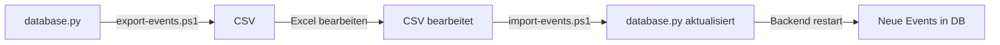

# Event-Verwaltungs-Scripts

Dieses Verzeichnis enthält Scripts zum Exportieren und Importieren von Event-Daten zwischen CSV-Dateien und der `backend/app/core/database.py`.

## 📋 Übersicht

| Script | Funktion | Sicher |
|--------|----------|--------|
| `export-events.ps1` | Exportiert Events → CSV | ✅ Ja (Read-Only) |
| `import-events.ps1` | Importiert CSV → database.py | ⚠️ Vorsicht (schreibt Dateien) |

## 🚀 Schnellstart

### Events exportieren
```powershell
.\scripts\export-events.ps1
```
**Output**: `event-options-export.csv` (36 Events, UTF-8, Excel-kompatibel)

### Events bearbeiten
1. Öffne `event-options-export.csv` in Excel
2. Bearbeite, füge hinzu, lösche Events
3. Speichere als CSV (UTF-8, Semikolon-Delimiter)

### Events importieren
```powershell
.\scripts\import-events.ps1
```
**Effekt**: Ersetzt `seeds_by_region` in `backend/app/core/database.py`

## 📚 Detaillierte Dokumentation

- **Export**: [README-export-events.md](README-export-events.md)
- **Import**: [README-import-events.md](README-import-events.md)

## 🔄 Typischer Workflow



### Schritt-für-Schritt

1. **Export durchführen**
   ```powershell
   cd C:\Users\asi\Documents\GitHub\event-horizon
   .\scripts\export-events.ps1
   ```
   ➡️ Erstellt `event-options-export.csv`

2. **CSV in Excel öffnen**
   - Doppelklick auf `event-options-export.csv`
   - Excel öffnet automatisch mit korrektem Encoding

3. **Events bearbeiten**
   - ✏️ Bestehende Events ändern
   - ➕ Neue Events hinzufügen
   - ❌ Events löschen
   - 🔄 Kategorien/Regionen anpassen

4. **CSV speichern**
   - `Datei → Speichern` (behält Format bei)
   - ODER `Datei → Speichern unter → CSV UTF-8`

5. **Import durchführen**
   ```powershell
   .\scripts\import-events.ps1
   ```
   - Bestätigung mit `j` oder `y`
   - Automatisches Backup wird erstellt

6. **Backend neu starten**
   ```bash
   cd backend
   uvicorn app.main:app --reload
   ```

7. **Frontend testen**
   - `http://localhost:8080`
   - Campaign Detail → Aktivitäten-Tab
   - Neue Events sollten sichtbar sein

## 🛡️ Sicherheit

### Export (Sicher)
- ✅ Nur Lesezugriff
- ✅ Keine Änderungen am Code
- ✅ Kann beliebig oft ausgeführt werden

### Import (Vorsicht!)
- ⚠️ **Überschreibt database.py**
- ✅ Automatisches Backup (Standard)
- ✅ CSV-Validierung vor Import
- ✅ Syntax-Prüfung des generierten Codes
- ❌ **NICHT ohne Backup verwenden!**

## 📝 CSV-Format

### Pflichtfelder

| Feld | Werte | Beispiel |
|------|-------|----------|
| `title` | Text | "Cyber-Artists & Steel City" |
| `category` | action, relax, food, party | "relax" |
| `location_region` | OOE, Tirol, Sbg, Stmk, Ktn | "OOE" |
| `est_price_pp` | Zahl > 0 | 80 |
| `min_participants` | Zahl > 0 | 8 |
| `season` | all_year, summer, winter | "all_year" |
| `description` | Text | "Vormittags..." |

### Optionale Felder

| Feld | Format |
|------|--------|
| `tags` | "tag1, tag2, tag3" |
| `accessibility_flags` | "wheelchair, vegan" |
| `weather_dependent` | "Ja" oder "Nein" |
| `image_url` | "https://..." |
| `is_mystery` | "Ja" oder "Nein" |

## 🔧 Erweiterte Verwendung

### Python-Scripts direkt

**Export:**
```bash
python scripts/export_events_to_csv.py -o my-events.csv
```

**Import:**
```bash
python scripts/import_events_from_csv.py my-events.csv
```

**Import ohne Backup (VORSICHT!):**
```bash
python scripts/import_events_from_csv.py my-events.csv --no-backup
```

### Custom database.py Pfad

```bash
python scripts/import_events_from_csv.py events.csv -d path/to/database.py
```

## 🆘 Troubleshooting

### Problem: Import schlägt fehl

**Lösung 1: Backup wiederherstellen**
```bash
cd backend/app/core
ls database_backup_*.py  # Finde Backup
cp database_backup_20250107_143022.py database.py
```

**Lösung 2: Git Reset**
```bash
git checkout backend/app/core/database.py
```

### Problem: Excel zeigt Umlaute falsch an

**Lösung**: CSV mit "UTF-8 BOM" öffnen
1. Excel → Daten → Aus Text/CSV
2. Datei auswählen → Dateiursprung: "65001: Unicode (UTF-8)"
3. Trennzeichen: Semikolon

### Problem: Validierungsfehler beim Import

**Lösung**: Fehlermeldungen lesen und CSV korrigieren
```
! Zeile 5: Ungültige Kategorie 'sport'
! Zeile 12: Preis muss größer als 0 sein
```

## 📊 Event-Statistiken

Nach Export/Import verfügbar:

- **Gesamt Events**: 36 (kann variieren)
- **Regionen**: 5 (OOE, Tirol, Sbg, Stmk, Ktn)
- **Kategorien**: 4 (action, relax, food, party)
- **Durchschnittspreis**: ~65€ p.P.
- **Preisbereich**: 20€ - 200€

## 🔗 Verwandte Dateien

```
scripts/
├── README.md                      # Diese Datei
├── README-export-events.md        # Export-Dokumentation
├── README-import-events.md        # Import-Dokumentation
├── export_events_to_csv.py       # Export-Script (Python)
├── import_events_from_csv.py     # Import-Script (Python)
├── export-events.ps1             # Export-Script (PowerShell)
└── import-events.ps1             # Import-Script (PowerShell)
```

## ⚙️ Technische Details

### Export
- **Dependencies**: Keine (Pure Python)
- **Encoding**: UTF-8 with BOM
- **Delimiter**: Semikolon (`;`)
- **Laufzeit**: < 1 Sekunde

### Import
- **Dependencies**: Keine (Pure Python)
- **Validierung**: Ja (alle Pflichtfelder)
- **Backup**: Automatisch (mit Timestamp)
- **Laufzeit**: < 2 Sekunden

### Code-Generierung
- **Format**: PEP 8 konform
- **Einrückung**: 4 Spaces
- **String-Escaping**: Ja
- **Syntax-Check**: Automatisch

## 💡 Tipps & Best Practices

### ✅ Empfohlen

1. **Immer exportieren vor Import**
   - Aktuellen Stand sichern
   - Als Referenz für Änderungen

2. **Git verwenden**
   ```bash
   git add backend/app/core/database.py
   git commit -m "Update event seeds"
   ```

3. **Kleine Änderungen**
   - Lieber mehrere kleine Imports
   - Einfacher zu debuggen

4. **Testen nach Import**
   - Backend starten
   - Frontend überprüfen
   - Filter testen

### ❌ Zu vermeiden

1. **Manuelles Bearbeiten von database.py**
   - Fehleranfällig
   - Schwer nachzuvollziehen

2. **Import ohne Backup**
   - Bei Fehler schwer rückgängig zu machen
   - Nur für Tests verwenden

3. **Unvalidierte CSV-Daten**
   - Kann zu Laufzeitfehlern führen
   - Import prüft automatisch

4. **Gleichzeitige Bearbeitung**
   - Nur eine Person sollte Events bearbeiten
   - Sonst Merge-Konflikte

## 📞 Support

Bei Problemen:

1. **Dokumentation lesen**
   - [Export README](README-export-events.md)
   - [Import README](README-import-events.md)

2. **Logs überprüfen**
   - Script-Output genau lesen
   - Fehlermeldungen beachten

3. **Backup wiederherstellen**
   - Bei schweren Fehlern
   - Mit Git oder Backup-Datei

4. **Issue erstellen**
   - GitHub Issues
   - Mit Fehlermeldung und CSV-Beispiel
